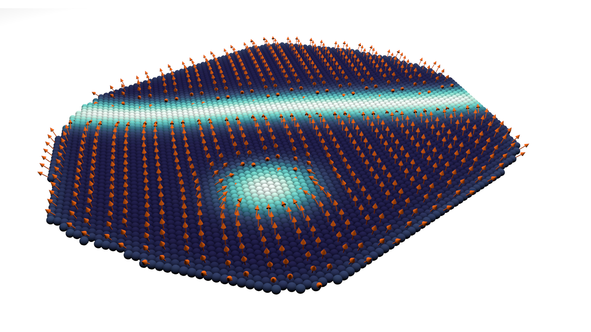

# Data set for: Simulation of Pd/Fe/Ir(111) systems

This repository contains the libraries and scripts to completely reproduce the
simulations of the publication *...*. These simulations are based on the
[Fidimag](http://doi.org/10.5334/jors.223) code [2] which can run discrete spin
simulations.

Images of the experimental data used in the simulations are located in the
`Romming_data` folder. These images were obtained by the group of [R.
Wiesendanger](http://www.nanoscience.de/HTML/) from the University of Hamburg.
Images are licensed under ...

## Scripts

Simulation scripts are located in the `simulation` folder, where they are
separated in three categories:

- **relaxation**: scripts that directly relax a given initial state for a
  particular geometry (the experimental island, hexagons or truncated
  triangles). Magnetic parameters can also be modified, see the `bash` scripts
  for details. The library containing all the available options and initial
  states is `hexagonal_fidimag.py`, which uses `argparse`.  The *relaxation*
  directory also contains the scripts to fully reproduce the phase diagrams
  shown in [1]. These simulations require substantial simulation time and disk
  space, thus it is recommended to start them with precaution.

- **hysteresis**: these scripts take the initial state from the *relaxation*
  simulations (specific paths to `npy` files might require updating the final
  step number) and perform a sequential field sweep of the system, according to
  the specified options. Scripts are written as `cfg` Python config files and
  the main library with the options is `hexagonal_hysteresis.py`.

- **NEBM**: these scripts also rely on the simulations from the *relaxation*
  folder to specify the initial state. The main library in this case is
  `hexagonal_neb_fidimag.py`, which uses the GNEBM implementation from Fidimag.

A library to create a mesh/simulation from an image is given in
`sim_from_image.py`. In our case we use the islands from experiments in the
`Romming_data` folder. A copy of the numpy array containing the spin data,
which was btained with this library for the island system, is stored in the
`mu_s` directory.

A library to create meshes with different geometries is given in the
`mesh_geometries` folder.

# Widget

An interactive widget is provided in the `simulation_widget_nb.ipynb` notebook
which runs the `simulation_widget.py` library. This widget is a proof of
concept for the extensibility of Fidimag, in this case with the IPython widgets
library. The notebook shows a simulation for the island system reproduced from
experiments but further options are available in `simulation_widget.py`

# Notebooks

Jupyter notebooks with the analysis of the data from the simulations are
provided in the `notebooks` directory. Notebooks can be viewed directly from
Github. In case you run the notebooks the paths to simulation files need to be
updated according to the simulation files produced in your machine (final time
steps might change) and the folders in your system (some notebooks might be
outdated). Notebooks with GNEBM results require the `nebm_plot_tools` library.

In this repository we provide 10 notebooks:

- **Hexagons NEBM skyrmion collapse.ipynb**: GNEBM results for the skyrmion
  collapse transition in hexagonal islands of varying size, applied field and
  boundary condition. Results are based on the simulations located in
  `simulations/NEBM/nebm_2Dhex_hexagons_PdFe-Ir_sk-down-collapse_B-sweep_DT/`
  and
  `simulations/NEBM/nebm_2Dhex_hexagons_PdFe-Ir_sk-down-collapse_B-sweep_pinned_boundary_DT/`

- **Hexagons NEBM skyrmion escape.ipynb**: GNEBM results for the skyrmion escape
  transition in hexagonal islands with free boundaries and varying size and
  applied field. Results are based on the simulations located in
  `simulations/NEBM/nebm_2Dhex_hexagons_PdFe-Ir_sk-down-escape_B-sweep_DT/`

- **Hexagons NEBM tgt-state-up skyrmion-down collapse.ipynb**: GNEBM results for
  the decay of a target state into a skyrmion in hexagonal islands of varying
  size, applied field and boundary condition. Results are based on the
  simulations located in
  `simulations/NEBM/nebm_2Dhex_hexagons_PdFe-Ir_tgt-st-up_sk-down_collapse_B-sweep_DT/`
  and
  `simulations/NEBM/nebm_2Dhex_hexagons_PdFe-Ir_tgt-st-up_sk-down_B-sweep_pinned_boundary_DT/`

- **Hexagons PdPdFe energies_positive_fields.ipynb**: Notebook analysing the
  energy of ferromagnetic orderings, skyrmions and target states in hexagonal
  islands, as a function of island size, applied field and boundary condition.
  The notebook also shows snapshots of the relaxed configurations. Results are
  based on the simulations located in
  `simulations/relaxation/hexagons_size_variation_DT/` and
  `simulations/relaxation/hexagons_size_variation_pinned_boundary_DT/`

- **Hexagons_phase_diagram.ipynb**: Phase diagram with the lowest energy
  configurations in hexagonal islands with free boundaries, as a function of
  island size and applied field. The phase diagram is shown both using the
  topological charge and the snapshots of the ground states. Results are based
  on the simulations located in
  `simulations/relaxation/hexagons_phase_diagram_B_L/`

- **Hexagons_phase_diagram_pinned_bs.ipynb**: Same than the previous phase
  diagram notebook but in islands with a ferromagnetic rim. Results are based
  on the simulations located in
  `simulations/relaxation/hexagons_phase_diagram_B_L_pinned_bs/`

- **image_rotated NEBM target state-skyrmion.ipynb**: GENBM results for the decay
  of target states into skyrmions in quasi-hexagonal islands fabricated
  experimentally. Results are shown as a function of the applied field.
  Simulation files are located in
  `simulations/NEBM/nebm_2Dhex_image-rotated_PdFe-Ir_tgt-st-up_sk-down_B-sweep_DT/`
  and
  `simulations/NEBM/nebm_2Dhex_image-rotated_PdFe-Ir_tgt-st-3PI_tgt-st-2PI_B-sweep_DT/`

- **image_rotated snapshots-positive_fields.ipynb**: Results for the simulation
  of hysteresis-like field sweep processes in quasi-hexagonal islands
  fabricated experimentally. Results are shown for different initial states and
  the energy of the configurations found during the simulated sweep process are
  compared with the energy of magnetic configurations found during a field
  sweep experiment. Results are based on the files located in
  `simulations/hysteresis/image_rotated_DT/`

- **image_rotated_energies_positive_fields.ipynb**: Notebook analysing the
  energies and topological charge of different magnetic configurations in
  quasi-hexagonal islands fabricated experimentally. Results are compared with
  the energies of configurations observed during a field sweep experiment.  In
  addition, the notebook provides details about the translation of the mesh
  from experiment into the simulations. Snapshots of different magnetic
  orderings are also shown along the notebook. Simulation files are
  located in `simulations/relaxation/image_rotated_B-sweep_DT/`

- **image_rotated_relaxed_from_image.ipynb**: Notebook showing the simulation of
  quasi-hexagonal islands fabricated experimentally. Simulations are directly
  compared with the experimental observations, which are based on SP-STM
  measurements. Simulation files are
  located in `simulations/relaxation/image_rotated_relax-from-image/`. Experimental
  images are provided in the `Romming_data/` folder

# Cite

If you find this material useful please cite us (you might need the LaTeX's
`url` package)

    @Misc{Cortes2018,
      author       = {David Cort{\'e}s-Ortu{\~n}o and James Loudon and Ryan Pepper and Marijan Beg and Ondrej Hovorka and Hans Fangohr},
      title        = {{Data set for: ...}},
      howpublished = {Zenodo \url{doi:10.5281/zenodo.1438396}. Github: \url{https://github.com/davidcortesortuno/paper_pdfeir_islands}},
      year         = {2018},
      doi          = {10.5281/zenodo.1438396},
      url          = {https://doi.org/10.5281/zenodo.1438396},
    }

# References

[1]

[2] Bisotti, M.-A., Cortés-Ortuño, D., Pepper, R., Wang, W., Beg, M., Kluyver,
T., & Fangohr, H. (2018). Fidimag – A Finite Difference Atomistic and
Micromagnetic Simulation Package. Journal of Open Research Software, 6(1), 22.
DOI: http://doi.org/10.5334/jors.223
